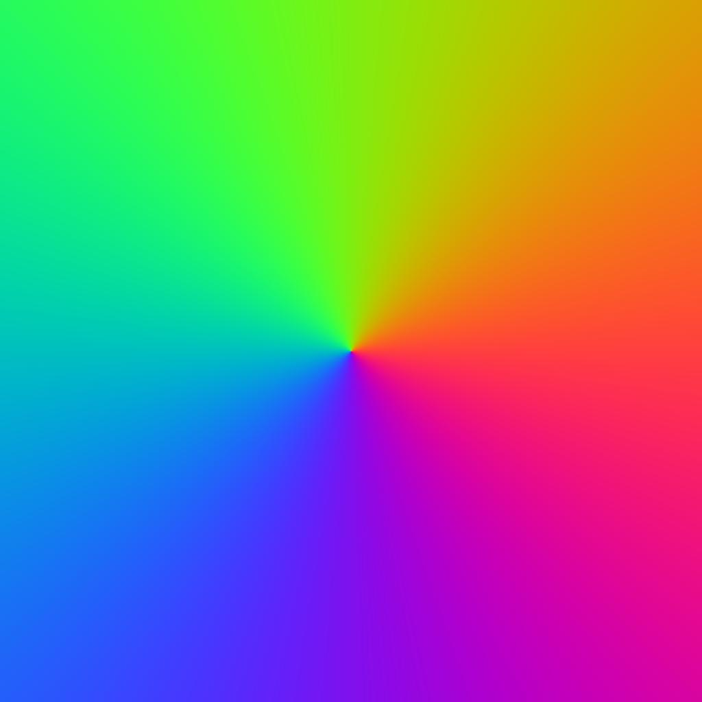
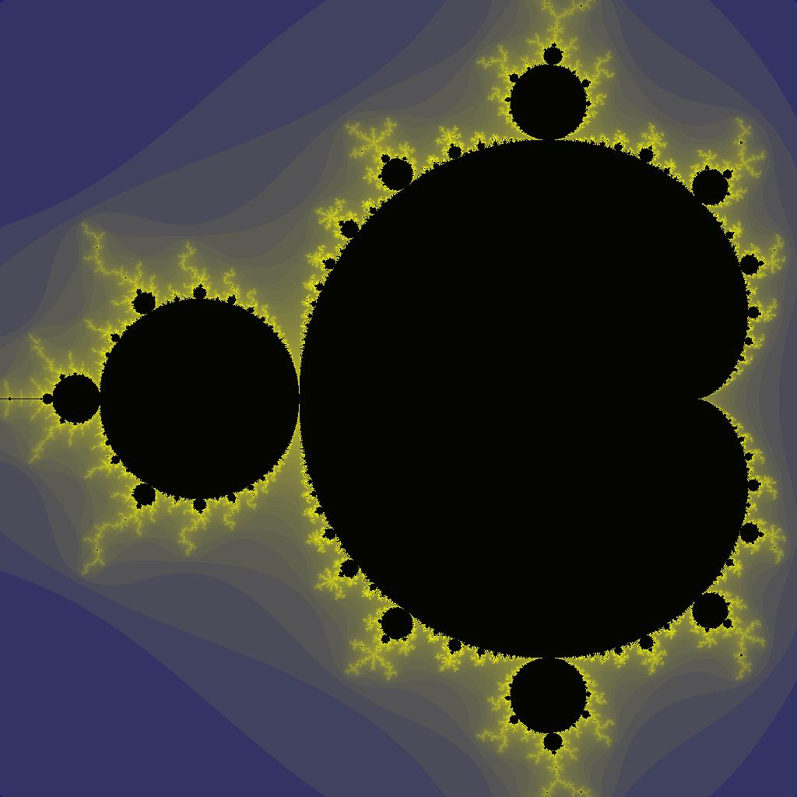
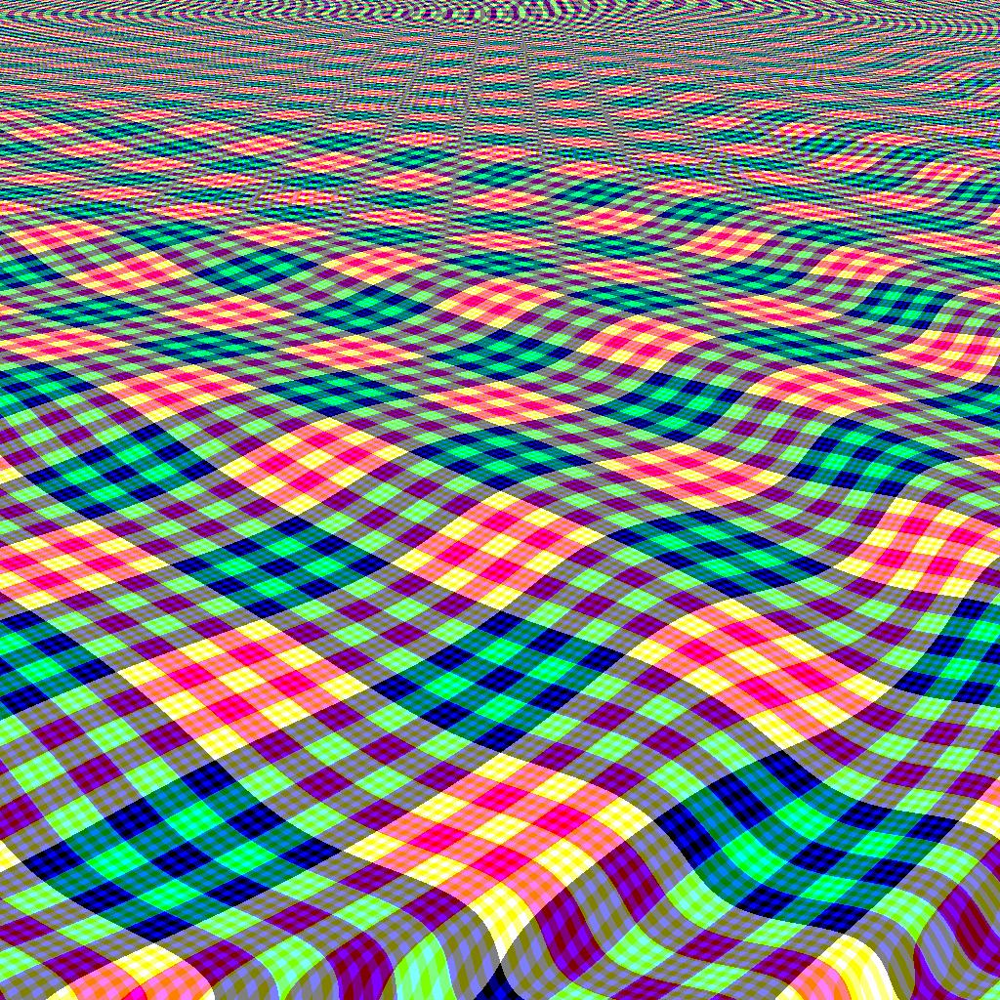

# draw_1024
Some code realization in competition from [Tweetable Mathematical Art](http://codegolf.stackexchange.com/questions/35569/tweetable-mathematical-art), belows are some of the images generated:

